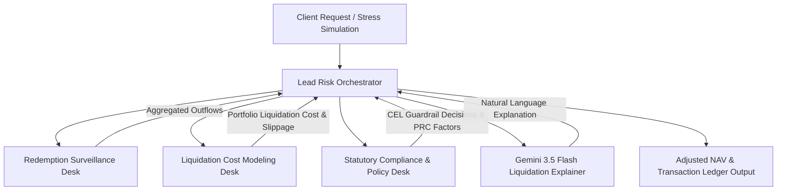

# System Architecture: SEBI Mutual Fund Swing Pricing & Outflow Stress Test Engine

This document details the architecture, multi-agent desks, regulatory rules, and mathematical calculation engines for the SEBI Mutual Fund Swing Pricing and Outflow Stress Test Engine (Project ID `120`).

---

## 1. Executive Summary & Regulatory Context

Under SEBI circular `SEBI/HO/IMD/IMD-II DOF3/P/CIR/2021/631` (effective May 1, 2022), Asset Management Companies (AMCs) in India are required to implement a **Swing Pricing Framework** for open-ended debt mutual fund schemes (excluding overnight, gilt, and gilt with 10-year maturity).

**Swing Pricing** adjusts a fund's Net Asset Value (NAV) downwards during heavy redemption stress. This ensures that transaction costs and market impact costs resulting from liquidating assets are borne by the outgoing (redeeming) investors, rather than diluting the value of the remaining unitholders' assets.

The framework mandates:
1. **Discretionary Swing Pricing:** Used during normal times when net outflows exceed AMC-specified thresholds.
2. **Mandatory Full Swing Pricing:** Triggered during periods of "market dislocation" (declared by SEBI) for high-risk schemes as classified by the Potential Risk Class (PRC) Matrix.
3. **Retail Exemption:** Redemptions up to **₹2 Lakh** per investor per scheme are exempt from swing pricing.

---

## 2. Multi-Agent Architecture (Multi-Desk Risk Network)

To model this complex process, the system uses a **Hierarchical Multi-Desk Risk Assessment Network** composed of four specialized agent desks and an orchestrator:



### Agent Roles & Workflows

1. **Lead Risk Orchestrator:**
   - Entry point for stress-test simulations.
   - Coordinates execution across the three desks.
   - Computes final adjusted NAV and updates the transaction ledger.
   - Invokes Gemini 3.5 Flash to generate a natural language narrative of the stress event.

2. **Redemption Surveillance Desk:**
   - Ingests incoming transactions.
   - Aggregates cumulative daily redemptions.
   - Identifies if net outflows exceed the threshold (e.g., 5% of AUM) or if a market dislocation period is active.
   - Separates transactions into exempt (< ₹2L) and non-exempt (> ₹2L) buckets at the PAN level.

3. **Liquidation Cost Modeling Desk:**
   - Models the actual physical liquidation of the fund's assets based on a liquidity hierarchy:
     $$\text{Cash} \rightarrow \text{Sovereign Debt (G-Sec)} \rightarrow \text{High-Grade Corporate Debt (AAA)} \rightarrow \text{Medium-Grade Corporate Debt (AA)} \rightarrow \text{High-Yield Debt (A/Below)}$$
   - Computes transaction costs (bid-ask spreads) and market impact slippage using a power-law cost function:
     $$\text{Liquidation Cost} = \sum_{i} \left( A_i \times S_i + \beta_i \times A_i \times \left(\frac{A_i}{V_i}\right)^2 \right)$$
     where $A_i$ is the liquidated amount of asset $i$, $S_i$ is the base spread, $V_i$ is the daily trading volume, and $\beta_i$ is the market impact coefficient.

4. **Statutory Compliance & Policy Desk:**
   - Evaluates incoming parameters against SEBI regulations using a deterministic **Common Expression Language (CEL)** engine.
   - Resolves Potential Risk Class (PRC) matrices and retrieves statutory minimum swing factors during market dislocation:
     - Class A-III: 1.50%
     - Class B-II: 1.25%
     - Class B-III: 1.75%
     - Class C-I: 1.50%
     - Class C-II: 1.75%
     - Class C-III: 2.00%
   - Checks DPDP Act 2023 compliance (masks Aadhaar and PAN strings).

5. **Gemini 3.5 Flash Liquidation Explainer:**
   - Takes the quantitative outputs (liquidation costs, swing factor, CEL trace) and writes an executive explanation for the fund trustees, detailing the liquidity waterfall, bid-ask spread impact, and why swing pricing was (or was not) applied.

---

## 3. Mathematical & Actuarial Model

### 3.1 Portfolio Composition & Liquidity Parameters
The stress engine models a credit risk portfolio. The default assets are:

| Asset Class | Credit Rating | Yield (YTM) | Allocation | Base Spread ($S_i$) | Daily Volume ($V_i$) | Impact Coeff ($\beta_i$) |
| :--- | :--- | :--- | :--- | :--- | :--- | :--- |
| **Cash / Triparty Repo** | AAA | 6.5% | 5% | 0.00% | $\infty$ | 0.0 |
| **G-Sec (Sovereign)** | Sovereign | 7.2% | 30% | 0.05% | ₹5,000 Cr | 0.1 |
| **Corporate Bonds AAA** | AAA | 7.8% | 35% | 0.15% | ₹1,000 Cr | 0.3 |
| **Corporate Bonds AA** | AA | 8.5% | 20% | 0.40% | ₹300 Cr | 0.6 |
| **High Yield Debt** | A & below | 10.5% | 10% | 1.50% | ₹50 Cr | 1.2 |

### 3.2 Liquidation Logic
When a redemption request of $R$ is simulated:
- Liquidate from the asset classes sequentially, starting from Cash down to High Yield Debt.
- For each liquidated asset $i$, calculate:
  - Amount Liquidated: $A_i = \min(\text{Available Balance}_i, R_{remaining})$
  - Cost of Liquidation: $C_i = A_i \times S_i + \beta_i \times A_i \times \left(\frac{A_i}{V_i}\right)^2$
  - Accumulate: $\text{Total Liquidation Cost} = \sum C_i$
- Reduce $R_{remaining} \leftarrow R_{remaining} - A_i$.

### 3.3 Swing Factor Application
- **Under Normal Times (Discretionary):** Applied if Net Outflow % $\ge$ Discretionary Threshold.
  $$\text{Swing Factor} = \min\left(\text{Max Discretionary Swing}, \frac{\text{Total Liquidation Cost}}{\text{Fund AUM}}\right)$$
- **Under Market Dislocation (Mandatory):** Applied if Scheme is in High-Risk PRC cell.
  $$\text{Swing Factor} = \max(\text{Statutory Minimum Swing}, \text{Computed Liquidation Cost Factor})$$
- Adjusted NAV:
  - For non-exempt redemptions/subscriptions: $\text{Adjusted NAV} = \text{Unswung NAV} \times (1 - \text{Swing Factor})$
  - For exempt redemptions ($\le$ ₹2 Lakh): $\text{Adjusted NAV} = \text{Unswung NAV}$

---

## 4. Statutory CEL Policy Guardrails

The system implements the statutory rules via deterministic Python validations resembling CEL behavior:

```python
# Pseudo-CEL for SEBI Swing Pricing Triggers
def eval_swing_policy(txn):
    rules = {
        "is_exempt_scheme": "scheme.category in ['overnight', 'gilt', 'gilt-10yr']",
        "is_retail_exempt": "transaction.amount_inr <= 200000 && transaction.type == 'redemption'",
        "is_mandatory_eligible": "market.dislocation_active && scheme.prc_class in ['A-III', 'B-II', 'B-III', 'C-I', 'C-II', 'C-III']",
        "normal_outflow_breach": "market.net_outflow_pct >= scheme.discretionary_threshold"
    }
    # ... evaluation logic ...
```

Additionally, DPDP Act 2023 compliance is enforced at the gateway:
- Aadhaar card (12 digits) is masked as `XXXXXXXX1234`.
- PAN (10 alphanumeric digits) is masked as `XXXXX1234X`.

---

## 5. Google Cloud Architecture Differentiators

- **Gemini 3.5 Flash:** Provides low-latency reasoning and structured JSON outputs for the liquidation impact reports.
- **Vertex AI Agent Platform:** Serves as the hosting environment for the multi-agent desks and orchestrator.
- **Statutory CEL Execution:** Runs high-speed policy checks on the edge before invoking any GenAI models, reducing token costs and ensuring 100% security compliance.
