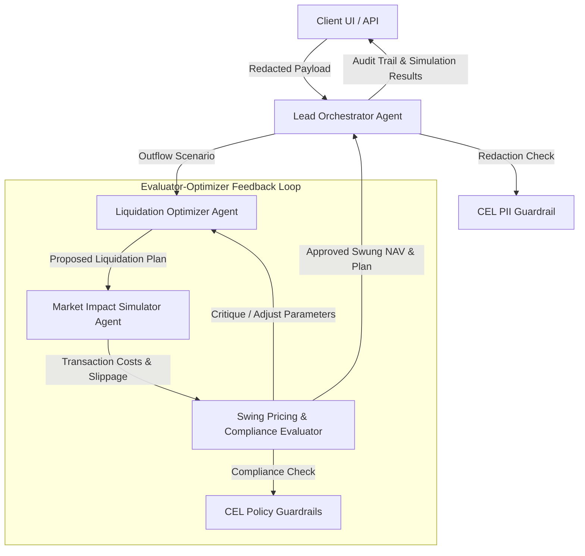

# Mutual Fund Swing Pricing & Outflow Stress Test Engine
## Architectural & System Design Document

This document outlines the architecture, mathematical model, multi-agent simulation workflow, API schema, and statutory CEL guardrail policies for the **Mutual Fund Swing Pricing & Outflow Stress Test Engine** (Project ID 120). This system is designed in compliance with SEBI Circular `SEBI/HO/IMD/IMD-II DOF3/P/CIR/2021/631` (and subsequent updates) governing swing pricing frameworks for open-ended debt mutual fund schemes in India.

---

## 1. Executive Summary & Regulatory Context

### 1.1 The Swing Pricing Mandate
During periods of high redemptions, mutual fund managers must liquidate portfolio assets to meet cash outflows. Selling assets—particularly illiquid or semi-liquid debt instruments—incurs transaction costs (bid-ask spreads) and causes adverse price impact (slippage). Under standard Net Asset Value (NAV) calculations, these transaction costs are borne by the *remaining* unitholders of the fund, leading to dilution of value and potential "run-on-the-fund" dynamics.

**Swing Pricing** mitigates this by adjusting (swinging) the scheme’s NAV downwards during net outflow periods. Exiting investors redeem at the lower "swung" NAV, effectively paying for the transaction costs they impose on the fund, while remaining investors are protected from dilution.

### 1.2 SEBI Hybrid Swing Pricing Framework
The engine implements SEBI’s hybrid swing pricing model:
1. **Partial Swing (Normal Market Conditions):**
   * **Trigger:** Applicable when net outflows exceed an AMC-defined threshold (e.g., 5% of AUM).
   * **Application:** The AMC applies a computed swing factor based on estimated transaction costs.
2. **Mandatory Full Swing (Market Dislocation):**
   * **Trigger:** Declared by SEBI during systemic credit or liquidity stress.
   * **Application:** Mandatory for all open-ended debt schemes classified as High or Very High Risk (except overnight, Gilt, and Gilt 10-year funds). A mandatory minimum swing factor (1.00% to 2.00%) is applied depending on the scheme's **Potential Risk Class (PRC) Matrix** cell:

| Interest Rate Risk (Macaulay Duration) ↓ | Class A (CRV ≥ 12) | Class B (CRV ≥ 10) | Class C (CRV < 10) |
| :--- | :---: | :---: | :---: |
| **Class I** (MD ≤ 1 Year) | - | - | **1.50%** (Cell C-I) |
| **Class II** (MD ≤ 3 Years) | - | **1.25%** (Cell B-II) | **1.75%** (Cell C-II) |
| **Class III** (Any MD) | **1.00%** (Cell A-III) | **1.50%** (Cell B-III) | **2.00%** (Cell C-III) |

---

## 2. Multi-Agent Evaluator-Optimizer Architecture

To simulate realistic portfolio liquidation and swing pricing under stress, the engine uses an **Evaluator-Optimizer agentic loop**. Rather than a static linear solver, this pattern simulates how a trading desk, risk officer, and compliance desk interact during a market stress event.



### 2.1 Agent Roles & Responsibilities

#### A. Lead Orchestrator Agent
* **Role:** Supervisor and workflow manager.
* **Responsibilities:**
  * Receives incoming stress test request parameters.
  * Invokes the CEL PII Guardrail to ensure investor details (Aadhaar, PAN, Name) are sanitized.
  * Coordinates the simulation iterations between the Liquidation Optimizer and the Swing Pricing Evaluator.
  * Manages state, tracks latency, compiles final token metrics, and writes the structured JSONL audit trail (`audit_trace.jsonl`).

#### B. Liquidation Optimizer Agent (The "Trader")
* **Role:** Optimizer/Worker.
* **Responsibilities:**
  * Generates an asset-sale plan to raise the required cash (outflow target) from the portfolio.
  * Balances two conflicting liquidation strategies:
    1. **Waterfall Liquidation:** Selling the most liquid assets first (G-Secs/AAA bonds). Minimizes immediate transaction costs but leaves the remaining portfolio highly illiquid and risky.
    2. **Pro-Rata Liquidation (Vertical Slice):** Selling a proportional slice of all asset classes. Preserves the fund's risk profile (duration and credit quality) but forces the sale of illiquid assets at a steep discount.
  * Incorporates feedback (critique) from the Evaluator to modify the liquidation ratio (e.g., selling more semi-liquid assets to keep remaining illiquid exposure below regulatory caps).

#### C. Market Impact Simulator Agent (The "Execution Desk")
* **Role:** Worker/Calculator.
* **Responsibilities:**
  * Takes the proposed liquidation plan from the Optimizer.
  * Calculates bid-ask spreads and dynamic price impact (slippage) for each asset class based on the active market regime (Normal, Stressed, Severe).
  * Computes the raw transaction cost ($\text{TC}_{\text{total}}$) and the initial unadjusted swing factor ($\text{SF}_{\text{calc}}$).

#### D. Swing Pricing & Compliance Evaluator Agent (The "Risk & Compliance Officer")
* **Role:** Evaluator.
* **Responsibilities:**
  * Validates the post-liquidation portfolio against statutory boundaries using the CEL policy engines:
    * Re-calculates the scheme's Risk-o-meter rating based on the new asset mix.
    * Checks if the remaining illiquid exposure exceeds the compliance limit (e.g., 35% of AUM).
    * Applies SEBI's swing pricing rules (Partial Swing triggers or Mandatory Full Swing factors).
  * **Critique Mechanism:** If the liquidation plan violates portfolio limits or causes excessive drift, the Evaluator generates structured feedback (e.g., *"Critique: Pro-rata liquidation of illiquid assets caused a 2.3% price impact, violating the maximum slippage tolerance of 1.5%. Shift 15% of the liquidation volume to G-Secs to minimize cost, or adjust swing pricing upwards."*).

---

## 3. Financial Mathematics & Simulation Engine

### 3.1 Portfolio Composition
The mutual fund portfolio is modeled with three asset classes:
1. **Liquid Bonds ($A_{\text{liq}}$):** Government Securities (G-Secs), Treasury Bills, AAA Corporate Bonds.
2. **Semi-Liquid Commercial Papers ($A_{\text{semi}}$):** High-grade CPs, Certificates of Deposit, AA+ Corporate Bonds.
3. **Illiquid Corporate Debt ($A_{\text{ill}}$):** Corporate bonds rated AA or below, structured debt.

The initial portfolio value is represented as the Scheme Asset Under Management ($\text{AUM}_{\text{pre}}$).
$$\text{AUM}_{\text{pre}} = V_{\text{liq}} + V_{\text{semi}} + V_{\text{ill}}$$

### 3.2 Price Impact & Transaction Cost Formulation
When the fund sells an asset amount $X_i$ for asset class $i \in \{ \text{liq}, \text{semi}, \text{ill} \}$, the transaction cost ($\text{TC}_i$) is the sum of the **Bid-Ask Spread** and the **Price Impact (Market Slippage)**:

$$\text{TC}_i = X_i \times \left( S_i + \text{Price Impact}_i \right)$$

Where:
* $S_i$ is the base bid-ask spread percentage. Under market stress, spreads widen:
  $$S_i = S_{i, \text{base}} \times \text{Spread Stress Multiplier}$$
* $\text{Price Impact}_i$ is modeled using a power-law function of the transaction size relative to the market depth ($D_i$):
  $$\text{Price Impact}_i = C_i \times \left( \frac{X_i}{D_i} \right)^{\alpha}$$
  * $C_i$ is the price impact scaling coefficient.
  * $D_i$ is the daily market depth limit in INR. In stressed markets, depth contracts:
    $$D_i = D_{i, \text{base}} \times \text{Depth Stress Multiplier}$$
  * $\alpha$ is the price impact exponent (typically $\alpha = 1.0$ for linear impact, or $\alpha = 0.5$ for square-root impact).

The total transaction cost incurred during liquidation is:
$$\text{TC}_{\text{total}} = \sum_{i \in \{\text{liq}, \text{semi}, \text{ill}\}} \text{TC}_i$$

### 3.3 Swing Factor Calculation & NAV Adjustment
1. **Raw Swing Factor ($\text{SF}_{\text{calc}}$):**
   $$\text{SF}_{\text{calc}} = \frac{\text{TC}_{\text{total}}}{\text{AUM}_{\text{pre}}}$$

2. **SEBI Compliance Check & Final Applied Swing Factor ($\text{SF}_{\text{applied}}$):**
   * **Market Dislocation Mode:** If SEBI declares market dislocation, the engine identifies the scheme's Potential Risk Class (PRC) matrix cell (e.g., `B-III`).
     $$\text{SF}_{\text{applied}} = \max(\text{SF}_{\text{calc}}, \text{SF}_{\text{sebi\_mandatory}})$$
     Where $\text{SF}_{\text{sebi\_mandatory}}$ is defined by the regulatory matrix (e.g., 1.50% for `B-III`).
   * **Normal Market Mode:** Swing pricing is only active if the net outflow percentage ($R = \frac{\text{Outflow}}{\text{AUM}_{\text{pre}}}$) exceeds the partial swing threshold ($R_{\text{threshold}}$, typically 5.0%):
     $$\text{SF}_{\text{applied}} = \begin{cases} 
       \text{SF}_{\text{calc}} & \text{if } R \ge R_{\text{threshold}} \\
       0.0 & \text{if } R < R_{\text{threshold}}
     \end{cases}$$

3. **NAV Adjustment:**
   The adjusted NAV is computed from the unswung NAV ($\text{NAV}_{\text{original}}$):
   $$\text{NAV}_{\text{swung}} = \text{NAV}_{\text{original}} \times \left(1 - \text{SF}_{\text{applied}}\right)$$
   All exiting units are redeemed at $\text{NAV}_{\text{swung}}$, preventing dilution for the remaining unitholders.

---

## 4. System Sequence Diagram

The sequence below illustrates the end-to-end flow of a stress test request through the engine:

```
Client UI/API           Orchestrator          CEL Guardrail       Optimizer          Simulator          Evaluator
     |                       |                      |                 |                  |                  |
     |--- POST /stress ----->|                      |                 |                  |                  |
     |    (Payload with PII) |                      |                 |                  |                  |
     |                       |--- Evaluate PII ---->|                 |                  |                  |
     |                       |<-- [Redacted Output]-|                 |                  |                  |
     |                       |                                        |                  |                  |
     |                       |============ [ Loop: Max 3 Iterations ] =====================================|
     |                       |--- Propose Liquidation Plan ------------------------------>|                  |
     |                       |    (Redemption target & initial weights)                  |                  |
     |                       |                                                           |--- Simulate ---->|
     |                       |                                                           |    spread/impact |
     |                       |                                                           |<-- raw metrics---|
     |                       |                                                                              |
     |                       |--- Evaluate Plan & Compute Swing Factor ------------------------------------>|
     |                       |    (Check SEBI triggers, Risk-o-meter, limits via CEL)                       |
     |                       |<-- [Return: Status (Approved/Critique)] -------------------------------------|
     |                       |                                                                              |
     |                       |-- [If Rejected]: Pass Critique to Optimizer -------------------------------->|
     |                       |                                                                              |
     |                       |==============================================================================|
     |                       |
     |                       |--- Write structured entry to audit_trace.jsonl
     |                       |
     |<-- JSON Response -----|
     |    (Swung NAV, slippage,
     |     compliance status)
```

---

## 5. API Schemas & OpenAPI Specification

### 5.1 Endpoint Summary
1. `POST /api/redact` - Sanitizes incoming transactional requests to remove investor PII.
2. `POST /api/simulate-stress` - Initiates the Evaluator-Optimizer loop for outflow stress testing.
3. `GET /api/config` - Retrieves system thresholds, PRC swing factor matrices, and stress multipliers.
4. `POST /api/config` - Updates system variables (e.g., toggles market dislocation mode).
5. `GET /api/audit-trail` - Fetches JSONL logs for compliance reporting.

### 5.2 OpenAPI 3.0 Schema Definition (JSON)

```json
{
  "openapi": "3.0.3",
  "info": {
    "title": "SEBI Mutual Fund Swing Pricing & Outflow Stress Test Engine API",
    "version": "1.0.0",
    "description": "API for simulating mutual fund redemptions, computing bid-ask spreads and price impact, applying SEBI swing pricing regulations, and running compliance checks."
  },
  "paths": {
    "/api/redact": {
      "post": {
        "summary": "Redact Investor PII",
        "description": "Scans and masks PAN, Aadhaar, and Name fields within the request payload in accordance with the DPDP Act 2023.",
        "requestBody": {
          "required": true,
          "content": {
            "application/json": {
              "schema": {
                "$ref": "#/components/schemas/InvestorTransaction"
              }
            }
          }
        },
        "responses": {
          "200": {
            "description": "Sanitized transaction payload",
            "content": {
              "application/json": {
                "schema": {
                  "$ref": "#/components/schemas/InvestorTransaction"
                }
              }
            }
          }
        }
      }
    },
    "/api/simulate-stress": {
      "post": {
        "summary": "Execute Outflow Stress Test",
        "description": "Simulates asset liquidation under configured market stress regimes, evaluates swing pricing triggers, and executes the Evaluator-Optimizer loop.",
        "requestBody": {
          "required": true,
          "content": {
            "application/json": {
              "schema": {
                "$ref": "#/components/schemas/StressTestRequest"
              }
            }
          }
        },
        "responses": {
          "200": {
            "description": "Stress test and swing pricing results",
            "content": {
              "application/json": {
                "schema": {
                  "$ref": "#/components/schemas/StressTestResult"
                }
              }
            }
          }
        }
      }
    },
    "/api/config": {
      "get": {
        "summary": "Get Config",
        "responses": {
          "200": {
            "description": "Active system configurations",
            "content": {
              "application/json": {
                "schema": {
                  "type": "object"
                }
              }
            }
          }
        }
      },
      "post": {
        "summary": "Update Config",
        "requestBody": {
          "required": true,
          "content": {
            "application/json": {
              "schema": {
                "type": "object"
              }
            }
          }
        },
        "responses": {
          "200": {
            "description": "Config updated successfully"
          }
        }
      }
    }
  },
  "components": {
    "schemas": {
      "InvestorTransaction": {
        "type": "object",
        "required": ["investor_name", "investor_pan", "investor_aadhaar", "redemption_amount_inr"],
        "properties": {
          "investor_name": {
            "type": "string",
            "example": "Adhish Thite"
          },
          "investor_pan": {
            "type": "string",
            "example": "ABCDE1234F"
          },
          "investor_aadhaar": {
            "type": "string",
            "example": "123456789012"
          },
          "redemption_amount_inr": {
            "type": "number",
            "example": 500000.0
          }
        }
      },
      "StressTestRequest": {
        "type": "object",
        "required": ["scheme_name", "risk_o_meter", "prc_cell", "pre_stress_aum_inr", "target_outflow_pct", "market_regime"],
        "properties": {
          "scheme_name": {
            "type": "string",
            "example": "Alpha High Yield Debt Fund"
          },
          "risk_o_meter": {
            "type": "string",
            "enum": ["LOW", "MODERATE", "HIGH", "VERY_HIGH"],
            "example": "VERY_HIGH"
          },
          "prc_cell": {
            "type": "string",
            "enum": ["A-I", "A-II", "A-III", "B-I", "B-II", "B-III", "C-I", "C-II", "C-III"],
            "example": "B-III"
          },
          "pre_stress_aum_inr": {
            "type": "number",
            "example": 10000000000.0
          },
          "target_outflow_pct": {
            "type": "number",
            "minimum": 0.1,
            "maximum": 100.0,
            "example": 15.0
          },
          "market_regime": {
            "type": "string",
            "enum": ["NORMAL", "STRESSED", "SEVERE"],
            "example": "STRESSED"
          },
          "liquidation_strategy": {
            "type": "string",
            "enum": ["PRO_RATA", "WATERFALL", "OPTIMIZED"],
            "default": "OPTIMIZED"
          }
        }
      },
      "StressTestResult": {
        "type": "object",
        "properties": {
          "scheme_name": { "type": "string" },
          "original_nav": { "type": "number", "example": 100.0 },
          "swung_nav": { "type": "number", "example": 98.5 },
          "applied_swing_factor_pct": { "type": "number", "example": 1.50 },
          "swing_pricing_status": {
            "type": "string",
            "enum": ["INACTIVE", "PARTIAL_TRIGGERED", "MANDATORY_FULL_TRIGGERED"]
          },
          "total_transaction_cost_inr": { "type": "number", "example": 18200000.0 },
          "liquidation_details": {
            "type": "object",
            "properties": {
              "liquid_liquidated_inr": { "type": "number" },
              "semi_liquid_liquidated_inr": { "type": "number" },
              "illiquid_liquidated_inr": { "type": "number" }
            }
          },
          "post_stress_portfolio": {
            "type": "object",
            "properties": {
              "liquid_ratio": { "type": "number" },
              "semi_liquid_ratio": { "type": "number" },
              "illiquid_ratio": { "type": "number" }
            }
          },
          "portfolio_drift_detected": { "type": "boolean" },
          "iterations_to_converge": { "type": "integer", "example": 2 },
          "cel_policy_verdict": {
            "type": "string",
            "enum": ["CLEARED", "BLOCKED"],
            "example": "CLEARED"
          },
          "rejection_reason": { "type": "string" }
        }
      }
    }
  }
}
```

---

## 6. Statutory CEL Policy Guardrails

The engine utilizes Google Cloud's Common Expression Language (CEL) policy engine to run real-time, microsecond-latency evaluation on regulatory compliance and PII protection.

### 6.1 Policy 1: PII Protection (`pii_protection.cel`)
Verifies that investor PAN, Aadhaar, and Names are redacted or masked before transaction payloads pass to the LLM agent workspace.
* **File Location:** [`policies/pii_protection.cel`](file:///usr/local/google/home/adhishthite/Projects/BFSI_AUTOMATED/120_sebi_mf_swing_pricing_stress_engine/policies/pii_protection.cel)
* **CEL Expression:**
```cel
has(input.investor_aadhaar) && input.investor_aadhaar != "" ? (
  !input.investor_aadhaar.matches('^[0-9]{12}$') &&
  (input.investor_aadhaar.matches('^XXXX-XXXX-[0-9]{4}$') || input.investor_aadhaar.matches('^XXXXXXXX[0-9]{4}$'))
) : true 
&&
has(input.investor_pan) && input.investor_pan != "" ? (
  !input.investor_pan.matches('^[A-Z]{5}[0-9]{4}[A-Z]{1}$') &&
  input.investor_pan.matches('^XXXXX[0-9]{4}[A-Z]$')
) : true
&&
has(input.investor_name) && input.investor_name != "" ? (
  input.investor_name.startsWith('***') || input.investor_name.contains('MASKED')
) : true
```

### 6.2 Policy 2: SEBI Swing Pricing Trigger Compliance (`swing_pricing_triggers.cel`)
Validates that during normal market conditions, partial swing pricing is active if the net outflow ratio exceeds the defined threshold. During a SEBI-declared market dislocation, it enforces that high-risk schemes apply the correct mandatory swing factor.
* **File Location:** [`policies/swing_pricing_triggers.cel`](file:///usr/local/google/home/adhishthite/Projects/BFSI_AUTOMATED/120_sebi_mf_swing_pricing_stress_engine/policies/swing_pricing_triggers.cel)
* **CEL Expression:**
```cel
// Enforce Full Swing during Market Dislocation for High/Very High Risk schemes
(
  config.market_dislocation_active && 
  (input.risk_o_meter == "HIGH" || input.risk_o_meter == "VERY_HIGH")
) ? (
  input.swing_pricing_active == true &&
  (
    input.prc_cell == "A-III" ? input.applied_swing_factor_pct >= config.prc_matrix_swing_factors.A_III :
    input.prc_cell == "B-II"  ? input.applied_swing_factor_pct >= config.prc_matrix_swing_factors.B_II :
    input.prc_cell == "B-III" ? input.applied_swing_factor_pct >= config.prc_matrix_swing_factors.B_III :
    input.prc_cell == "C-I"   ? input.applied_swing_factor_pct >= config.prc_matrix_swing_factors.C_I :
    input.prc_cell == "C-II"  ? input.applied_swing_factor_pct >= config.prc_matrix_swing_factors.C_II :
    input.prc_cell == "C-III" ? input.applied_swing_factor_pct >= config.prc_matrix_swing_factors.C_III :
    input.applied_swing_factor_pct >= 1.00
  )
) : 

// Enforce Partial Swing Trigger during Normal times
(
  !config.market_dislocation_active && 
  input.net_outflow_pct >= config.partial_swing_threshold_pct
) ? (
  input.swing_pricing_active == true && 
  input.applied_swing_factor_pct > 0.0
) : true
```

### 6.3 Policy 3: Portfolio Concentration Compliance (`portfolio_compliance.cel`)
Monitors the asset allocation to ensure that illiquid exposures remain within statutory thresholds and that the fund's Risk-o-meter rating matches its asset liquidity profile.
* **File Location:** [`policies/portfolio_compliance.cel`](file:///usr/local/google/home/adhishthite/Projects/BFSI_AUTOMATED/120_sebi_mf_swing_pricing_stress_engine/policies/portfolio_compliance.cel)
* **CEL Expression:**
```cel
// If illiquid assets exceed 30% of portfolio, Risk-o-meter must be High or Very High
(
  (input.portfolio_exposure.illiquid_ratio * 100.0) > 30.0
) ? (
  input.risk_o_meter == "HIGH" || input.risk_o_meter == "VERY_HIGH"
) : true
&&
// Illiquid exposure must never exceed the compliance limit (e.g., 35.0%)
(
  (input.portfolio_exposure.illiquid_ratio * 100.0) <= config.compliance_limits.max_illiquid_exposure_pct
)
```

---

## 7. Google Cloud AI Differentiators

* **Gemini 3.5 Pro & Vertex AI Agent Builder:** Powers the Evaluator-Optimizer loop. Pro's high reasoning capabilities and complex instruction-following enable deep mathematical critique of liquidation trades, simulating real compliance desk interactions.
* **Common Expression Language (CEL) on Google Cloud:** Used to build zero-trust statutory policy checkpoints. CEL evaluates compliance conditions in sub-milliseconds before executing LLM agent requests, securing the transaction pipeline against prompt injections and logical drift.
* **Vertex AI Security & PII Redaction:** Combines Vertex AI's context-window processing with pre-agent CEL redaction to prevent customer PII (PAN/Aadhaar) from leaking to LLM logs, ensuring DPDP Act compliance.
* **Structured JSONL Audit Tracing:** Implements structured trace logging for every agent thought, tool invocation, and policy validation step, offering auditor-ready records of financial stress testing outcomes.
